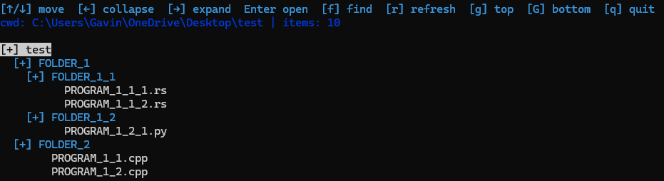

# Dirt
## A file viewer that allows you to look through, and open files.

### To install:
  **Step 1:** head to the latest release [here](https://github.com/Bractothorpes/dirt/releases/tag/v0.1.0) and install the .zip file.
  **Step 2:** once you have extracted the contents of the zip file run "dirtinstaller.exe" with adim permission to add dirt to your system path.
  **Step 3:** delete the dirt in your downloads doler (optional).
  **Step 3:** enjoy! you can now use dirt anywhere, try it out by running "dirt" in the terminal.

### How to use:
**Navigation:**
  - Use your arrow keys to navigate the dirt main menu, press [enter] to open a file or folder.
  - Arrows and [enter] also work in the seperate find menu.

**Keybinds:**
  - Use [q] to quit the program or exit the find menu.
  - Use [f] to search though all non-binary files in your folder tree for a peice of text.
  - Use [r] to refresh incase you added a new file.
  - Use [g] to go to the top.
  - Use [G] to go to the bottom.

**Configure:**
  - On Linux/OSX head to user/local/dirt, on Windows c:\Program Files\dirt
    Inside there will be a ".dirtconfig" file, you may edit this in 2 ways:
      1. changing editor=... (this will alter what editor opens files in dirt)
      2. changing skip_dirs=something,something... (this will change what dirs Dirt will *NOT* look for during word search)
   

      
**Note:**
  - default ignored folders: ".git", "node_modules", ".venv", "dist", "build", "target"
      
